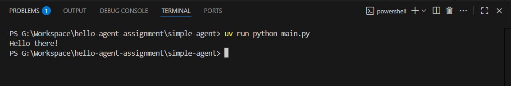

# Simple Agent

A minimal Python app using the OpenAI Agents SDK and uv. This agent prints a model-generated greeting to stdout.

## Features
- Loads API key from `.env` (never hardcoded)
- Uses `python-dotenv` for environment variables
- Minimal agent logic: prompts model to say hello
- Output screenshot included below

## Usage
1. Copy `.env.example` to `.env` and add your API key:
   ```
   GEMINI_API_KEY=your_api_key_here
   ```
2. Install dependencies:
   ```sh
   uv sync
   ```
3. Run the agent:
   ```sh
   uv run main.py
   ```

## Output



## Security
- `.env` is ignored by `.gitignore` and never committed
- Only `.env.example` is tracked

## References
- [OpenAI Agents SDK](https://openai.github.io/openai-agents-python/)
- [uv Docs](https://docs.astral.sh/uv/)
- [python-dotenv](https://github.com/theskumar/python-dotenv)
